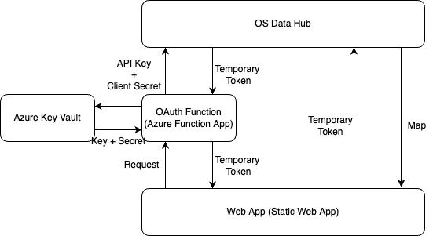
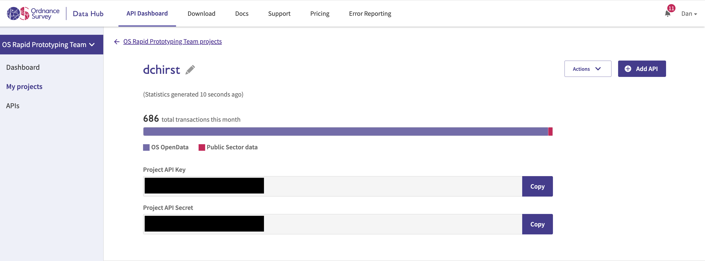
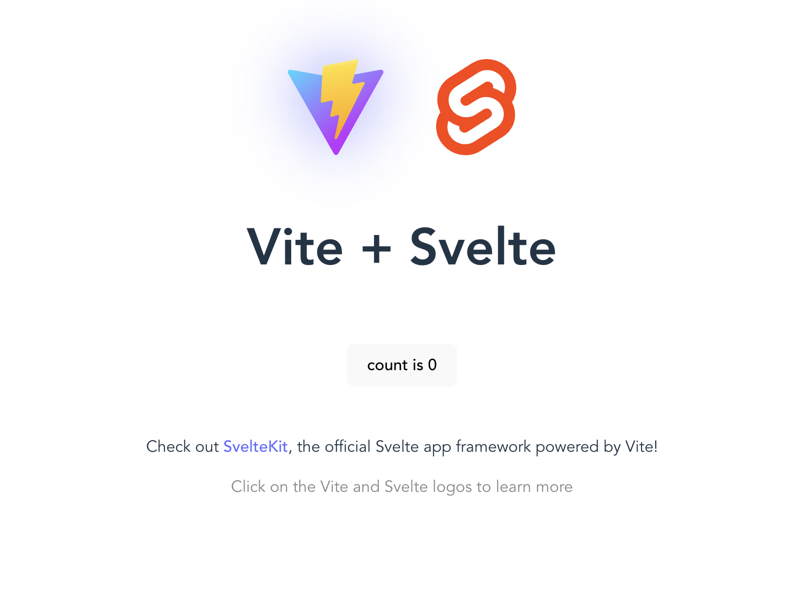
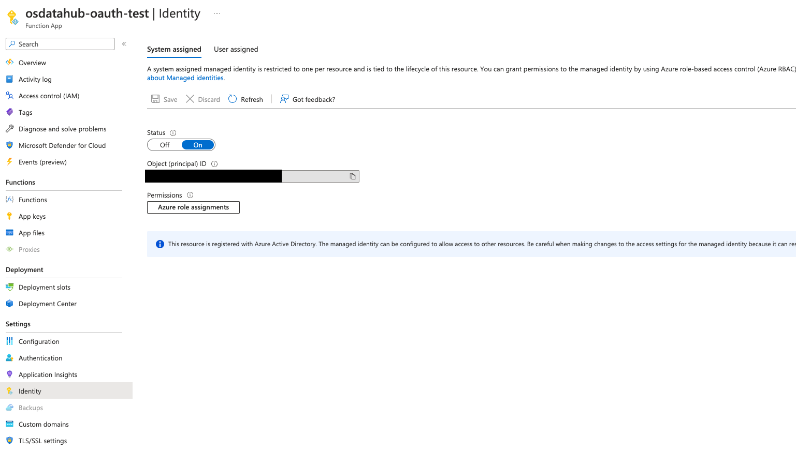

# OS Data Hub Tutorial - Using the OS OAuth API with Azure

In Ordnance Survey's Rapid Prototyping Team, we regularly develop web apps that are accessible to 
the public. As we look to productionise these prototypes, we have started thinking more about 
security. How do we protect our keys against bad actors who want to steal them?

The answer lies in OS Data Hub's OAuth API, a service that allows users to generate temporary keys to access
OS data. These temporary keys are hidden in the header of subsequent API requests, so they are not
publicly visible in the url of the request.

This blogpost charts our journey to create a sample website that uses the OAuth API to show an Ordnance Survey 
map. We will be using Azure Static Web Apps and Svelte, since that fits into the Rapid Prototyping 
Team's current stack, but hopefully this tutorial will provide a general roadmap for anyone trying 
to make their web map more secure.


## Part 0 - The Plan

To set up and deploy a secure web map can involve quite a few moving parts. There is the web app itself, which 
will be deployed on Azure Static Web Apps and built using Svelte. There is the API, which takes the
OS Data Hub API keys, queries the OAuth API, and returns a temporary token that can be used by the web app. There is
also an Azure Key Vault store that securely stores the OS Data Hub keys.



## Part 1 - Accessing OS Data Hub's API keys

To use the OS Data Hub OAuth API, we need 2 keys - a Project API key and a Project Secret key. We can find these tokens
on the [OS Data Hub website](https://osdatahub.os.uk/). 

If you have never used the OS Data Hub, you can get these keys by doing the following:

1. Create a new account at the [OS Data Hub website](https://osdatahub.os.uk/)
2. Go to API Dashboard > My Projects > Create a New Project
3. Enter a name for the project and select "Create Project"
4. Select Add an API to this project > Vector Tiles API

This should produce the following page with the requisite keys:




## Part 2 - Getting the Temporary Token

The OS Data Hub OAuth API takes in a Project API key and Project secret and returns a temporary token that 
can be used for a set number of seconds (default 300s). At its most basic, the terminal command to fetch an API token 
from the OS Data Hub OAuth API is as follows:

```bash
curl -u "projectAPIKey:projectAPISecret" -d "grant_type=client_credentials" "https://api.os.uk/oauth2/token/v1"
```

(Swap out `projectAPIKey` and `projectAPISecret` with your own credentials).

In Python, the easiest way to get this temporary token is through a library called 
[`Requests-OAuthlib`](https://pypi.org/project/requests-oauthlib/), which makes it 
incredibly simple to set up an OAuth Client and session before setting
up a token. The code to get a token from the OAuth API is:

```python
from oauthlib.oauth2 import BackendApplicationClient
from requests_oauthlib import OAuth2Session

token_url = "https://api.os.uk/oauth2/token/v1"
project_api_key = "<INSERT PROJECT API KEY HERE>"
client_secret = "<INSERT CLIENT SECRET HERE>"

client = BackendApplicationClient(client_id=project_api_key)
oauth = OAuth2Session(client=client)
token = oauth.fetch_token(token_url=token_url, client_id=project_api_key,
                          client_secret=client_secret)
```

We are able to use this as the basis for our function that gets the project api key and secret
from Azure Key Vault, queries the OS OAuth API, and returns the temporary token back to the web app. 

We will be implementing this code for the API in Part 6.


## Part 3 - Website Setup

We start by setting up a new project. We are making an app based on Svelte, so we run the following:

```
npm create vite@latest osdatahub_oauth -- --template svelte
cd osdatahub_oauth
npm install
```

You can change the framework you are using by simply [using a different vite template](https://vitejs.dev/guide/#trying-vite-online).

Just to check everything has worked, we can run the app by using:

```
npm run dev
```

which should generate a site that looks like this:




## Part 4 - Displaying a Web Map for OAuth

When using the temporary access token from the OS OAuth API, we cannot just place the token in the URL of any subsequent
OS Data Hub API query (e.g. `https://api.os.uk/maps/raster/v1/zxy/layer/{z}/{x}/{y}.png?key=<TEMP ACCESS TOKEN>`). 
Instead, we must place the key in an Authorization header of the request. The value of this header should be
`Bearer <TEMP ACCESS TOKEN>`. As a JSON, the full header of the map request should be:

```JSON
{
  "Authorization": "Bearer <TEMP ACCESS TOKEN>"
}
```

By using the Authorization header, the access token isn't visible in the map request - so the access token stays secure.

To include this header in the map request, we are using [MapLibre](https://maplibre.org/). The popular mapping library 
[Leaflet](https://leafletjs.com/) does not natively support the authorization header and so is inappropriate for our 
needs in this case.

To install MapLibre, we can run:

```bash
npm i maplibre-gl
```

We are also using the OS Vector Tile API to display the map, but the Maps API would also work.

In order to add an Authorization header, we can use the `transformRequest` parameter. The code to generate a new
Map Libre map with correct authentication is as follows:

```javascript
import { Map } from 'maplibre-gl';
import 'maplibre-gl/dist/maplibre-gl.css';

let apiKey = "<TEMP ACCESS TOKEN>"

let serviceUrl = "https://api.os.uk/maps/vector/v1/vts";
map = new Map({
  container: 'map',
  style: serviceUrl + '/resources/styles?',
  center: [-1.608411, 54.968004],
  zoom: 9,
  maxZoom: 15,
  transformRequest: url => {
      url += '&srs=3857';
      return {
          url: url,
          headers: {'Authorization': 'Bearer ' + apiKey}
      }
  }
});
```

In order to display this map in our Svelte map, we must put this code inside the Svelte function `onMount()` and add a 
`<div>` element with id `"map"`. The full `App.svelte` code is:

```sveltehtml
<script>
  import { onMount, onDestroy } from 'svelte'
  import { Map } from 'maplibre-gl';
  import 'maplibre-gl/dist/maplibre-gl.css';

  let map;
  let apiKey = "<TEMP ACCESS TOKEN>";

  onMount(() => {
      var serviceUrl = "https://api.os.uk/maps/vector/v1/vts";
      map = new Map({
          container: 'map',
          style: serviceUrl + '/resources/styles?',
          center: [-1.608411, 54.968004],
          zoom: 9,
          maxZoom: 15,
          transformRequest: url => {
              url += '&srs=3857';
              return {
                  url: url,
                  headers: {'Authorization': 'Bearer ' + apiKey}
              }
          }
      });
  });

  onDestroy(() => {
    map.remove();
  });
</script>

<div id="map" style="position: fixed" />

<style>
  #map {
    position: absolute;
    top: 0;
    left: 0;
    width: 100%;
    height: 100%;
    cursor: pointer;
  }
</style>
```

Now we have a function that gets a temporary access token from the OS OAuth API, and a web page that uses this token
to display a map. We will now bring this together to create a fully functioning deployed web map.

## Part 5 - Setting up a Key Vault

The Project API key and Project Secret will both be stored in an Azure Key Vault. This might be a bit overkill for 
our purposes, since we are only storing 2 keys, but it still works and we wanted to test it out for larger apps. If we wanted to skip this step, 
we could have simply set the keys as Application Settings in the Configuration section of our Function App on the Azure
Portal.


To set up a key vault, go to the Azure Portal, and search for the Key Vault service. Select "Create +", choose a name, 
and wait for the service to deploy.

Once the vault is deployed, go to the "Secrets" page to add your keys. Click "Generate/Import", choose a name for your 
keys (we choose `project-api-key` and `client-secret`), and insert the keys you generated from the OS Data Hub in 
Part 1.


## Part 6 - Creating an Azure Function

In order to get our temporary token from the OS OAuth API, we will be using a serverless service on Azure called a
Functions App. This will allow us to call the function via an HTTP trigger and get our access token without exposing
our details to the client side.

The easiest way to set up a Function is to go through Visual Studio Code. VSCode has an extension
called Azure Tools that allows you to set up, manage, and deploy your app from your IDE. 

To set up the function, we begin by creating a new folder in our repo called "api". Then we access the Show All Commands 
window by pressing `F1` and selecting "Azure Functions: Create Function". Select Python as our language, whatever python
interpreter we want for a virtual environment (3.9 in our case), HTTP Trigger as our template, and a name 
(`oauthfunction` in our case). The result should be a bunch of new boilerplate created in the `api` folder that will help
us create our app function.

The code for the function exists inside the `__init__.py` file. We can populate the file with the code request-oauthlib
code from Part 2:

```python
import logging

from oauthlib.oauth2 import BackendApplicationClient
from requests_oauthlib import OAuth2Session
import azure.functions as func
from azure.keyvault.secrets import SecretClient
import json
from azure.identity import DefaultAzureCredential

token_url = "https://api.os.uk/oauth2/token/v1"

def main(req: func.HttpRequest) -> func.HttpResponse:
    try:
        logging.info("Running oauth function")
        identity = DefaultAzureCredential()
        logging.info('Python HTTP trigger function processed a request.')
        secretClient = SecretClient(vault_url="<AZURE KEY VAULT URL>", credential=identity)
        logging.info("Authenticated")
        project_api_key = secretClient.get_secret('project-api-key').value

        client_secret = secretClient.get_secret('client-secret').value

        logging.info("Got api key and secret")
        client = BackendApplicationClient(client_id=project_api_key)
        oauth = OAuth2Session(client=client)
        logging.info("Connected to oauth client")
        token = oauth.fetch_token(token_url=token_url, client_id=project_api_key,
                                  client_secret=client_secret)
        logging.info('Got token')
        return json.dumps(token)

    except Exception as e:
        return func.HttpResponse(str(e), status_code=500)
```

Note that we must change the secretClient `vault_url` parameter to the url of the key vault you created in the previous
section. Again, if we want to skip key vault creation, we could simply store the api key and secret securely in the 
application settings of the function app once it's created.

Furthermore, we must tell Azure which libraries the function needs to install. We can do this by adding the following
libraries to the `requirements.txt` file.

```
azure-functions
azure-identity
azure-keyvault-secrets
requests-oauthlib
```

Finally, we can deploy the function by typing `F1` again and selecting "Create new Function App in Azure" with the runtime
as Python 3.9. Once the function app has been created, then right click the `api` and selecting "Deploy to Function App"
and choosing the function app you just created (we had to open the `api` folder in VSCode's File Explorer and trying 
this for it to work). The function must have authorization level set to "Anonymous").


Once the app has been deployed, we now need to connect the Function App to the Azure Key Vault. We can do this by 
navigating to the Function app on the Azure Portal, going to the 'Identity' section, and turning the "System Assigned"
slider to On. 



Once the slider is set to "On", a long string of characters should be revealed - this is the Function app's Object ID,
which we can use to authenticate to an Azure Key Vault. 

We copy this ID, and navigate to the Key vault on the Azure Portal. Here, we click the Access policies section, where
we select "Create". We want the Function to be able to Get the Key Vault's secrets, so we check the "Get" operation in the 
Secrets
section. For "Principal", we use the copied Object ID to search for the Function app, and select it. Finally, we can click
"Create" to connect the key vault to the Function app.

If we navigate back to the Function app, select the function we created above, and run the function, we should get back
an authenticated temporary token! Now, we must do the last step - publishing a static web app and connecting it to 
the function app.


## Part 7 - Deploying web app to Azure


In order to programatically get the temporary access token, we must write a JavaScript function in `App.svelte` that 
queries the Function app that we built above:

```javascript
let apiKey;
function getToken() {
  return fetch("/api/oauthfunction")
      .then((response) => response.json())
              .then(result => {
        if(result.access_token) {
            // Store this token
            apiKey = result.access_token;

            // Get a new token 30 seconds before this one expires
            const timeoutMS = (result.expires_in - 30) * 1000;
            setTimeout(getToken, timeoutMS);
        } else {
            // We failed to get the token
            return Promise.reject();
        }
    })
    .catch(error => {
        return Promise.reject();
    });
}
```

This function fetches the token by calling the Function app from a relative path (more on this in a bit) and sets the `apiKey` to be this new token. It 
also sets a timeout that is less than the returned timeout time, so that it will re-query the api and update the token
when the token is about to timeout.

We can combine this with the map component code from Part 4, to create a completed App.svelte file:

```sveltehtml
<script>
  import { onMount, onDestroy } from 'svelte'
  import { Map } from 'maplibre-gl';
  import 'maplibre-gl/dist/maplibre-gl.css';

  let map;
  let apiKey;
  function getToken() {
      return fetch("/api/oauthfunction")
          .then((response) => response.json())
                  .then(result => {
            if(result.access_token) {
                // Store this token
                apiKey = result.access_token;

                // Get a new token 30 seconds before this one expires
                const timeoutMS = (result.expires_in - 30) * 1000;
                setTimeout(getToken, timeoutMS);
            } else {
                // We failed to get the token
                return Promise.reject();
            }
        })
        .catch(error => {
            return Promise.reject();
        });
  }


  onMount(() => {
      getToken().then(() => {
          var serviceUrl = "https://api.os.uk/maps/vector/v1/vts";
          map = new Map({
              container: 'map',
              style: serviceUrl + '/resources/styles?',
              center: [-1.608411, 54.968004],
              zoom: 9,
              maxZoom: 15,
              transformRequest: url => {
                  url += '&srs=3857';
                  return {
                      url: url,
                      headers: {'Authorization': 'Bearer ' + apiKey}
                  }
              }
          });

      })


  });

  onDestroy(() => {
    map.remove();
  });
</script>

<div id="map" style="position: fixed" />

<style>
  #map {
    position: absolute;
    top: 0;
    left: 0;
    width: 100%;
    height: 100%;
    cursor: pointer;
  }
</style>
```

Now, we want to publish this site as an Azure Static Web App. We use Static Web Apps because they are 
cheaper to host because they don't require a backend server. With Azure Static Web Apps, we can also create
an API that is run from Azure Functions, which are serverless and therefore are also cheap to run. This is what we will
be doing for this tutorial.

The easiest way to set up a Static Web App is to go through Visual Studio Code. VSCode has an extension
called Azure Tools that allows you to set up, manage, and deploy your app from your IDE. 

To set up the app, we access the Show All Commands window by pressing `F1` and selecting "Azure Static Web Apps: Create
Static Web App". We answer all the prompts to tell Azure where to store the app, select Svelte as the build preset,
and setup a Git repository if we have not already done so. For the app location, select the root directory (`/`), and
`dist` for the output location.

This command sets up a CI/CD pipeline, through GitHub actions, that will rebuild and redeploy the app every time
we push a new change to the `main` git branch. Once the pipeline has finished running (you can see the progress of the 
pipeline in the Actions tab of the GitHub repo), we can find the deployed app in the Azure Portal, under
Static Website Apps. 


The final part of the puzzle is to connect the Static web app to the Functions App we created in the previous section.
In order to do that, we must go to the Static web app on the Azure portal, navigate to "APIs", and click "Link" to link
the Function app to the Static web app. Choose the function app we built earlier, and wait to for the changes to come
into effect.


Now, if we open up our static web app, we are met with the following beautiful app:


## Conclusion

In this tutorial, we have built a scalable, cheap web app that successfully hides our private OS API keys so that no one 
will be able to steal them. At best, a user can steal a temporary token that will timeout, limiting its utility.

There is still more we could be doing to improve our security as we build larger public apps for our customers. 
Ideally, we would hide the OAuth API request on a server where we do not need an HTTP request to communicate with the 
frontend. Nonetheless, by using Ordnance Survey's OAuth API, we are able to secure our apps and make it harder for malicious
actors to steal our keys.

**Note**: Although our permanent API keys will not be accessible, a malicious actor could still exploit a vulnerability 
by capturing the temporary token for use within its 5 minutes limit. The goal here is to increase security and make it 
less appealing fot a bad actor to take advantage of our services. If we wanted to remove this exploit completely, we'd 
need to make a non-static web app.


